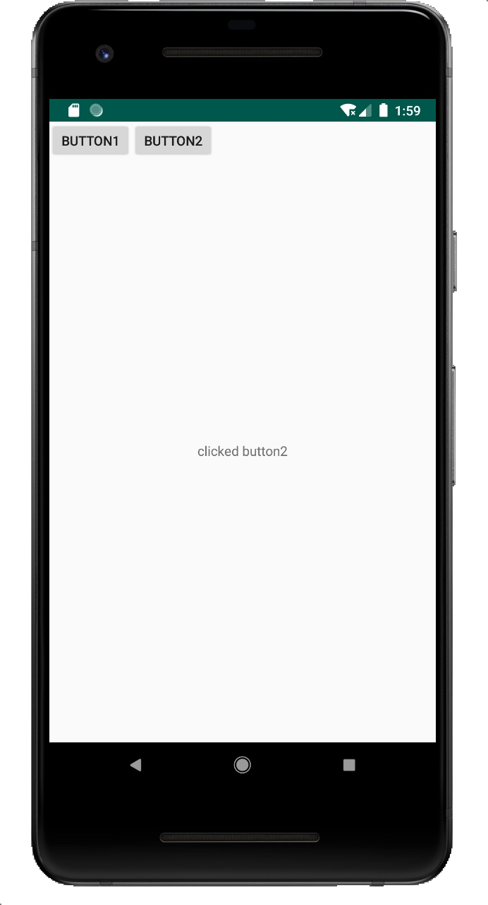

# 在Fragment中使用ViewModel

项目源码：[https://github.com/fungkamwah/viewmodel_demo](https://github.com/fungkamwah/viewmodel_demo)

### Model类
Message.java
```java 
package cn.mikezz.viewmodel_demo;

/**
 * Model
 *
 * Created by Mike(175511@qq.com) on 2019-05-08
 */
public class Message {

    public String string;

    public Message() {
        this.string = "init";
    }
}

```

### ViewModel类
MessageViewModel.java
```java
package cn.mikezz.viewmodel_demo;
import androidx.lifecycle.MutableLiveData;
import androidx.lifecycle.ViewModel;

/**
 * ViewModel
 *
* Created by Mike(175511@qq.com) on 2019-05-08
*/
public  class MessageViewModel extends ViewModel   {

    //被观察的liveData
    public final MutableLiveData<Message> liveData = new MutableLiveData<>();


}

```
### Fragment类
ContentFragment.java
```java
package cn.mikezz.viewmodel_demo;

import android.os.Bundle;
import android.view.LayoutInflater;
import android.view.View;
import android.view.ViewGroup;
import android.widget.TextView;

import androidx.annotation.NonNull;
import androidx.annotation.Nullable;
import androidx.fragment.app.Fragment;
import androidx.lifecycle.Observer;
import androidx.lifecycle.ViewModelProviders;

/**
 * Created by Mike(175511@qq.com) on 2019-05-08
 */
public class ContentFragment extends Fragment {

    MessageViewModel viewModel;

    /**
     * 获取ContentFragment实例，setArguments
     * @param example
     * @return
     */
    public static ContentFragment getInstance(String example){
        ContentFragment fragment = new ContentFragment();
        Bundle bundle = new Bundle();
        bundle.putString("key",example);
        fragment.setArguments(bundle);
        return fragment;
    }

    @Nullable
    @Override
    public View onCreateView(@NonNull LayoutInflater inflater, @Nullable ViewGroup container, @Nullable Bundle savedInstanceState) {
        View view = inflater.inflate(R.layout.layout_fragment,null);
        Bundle b =getArguments();
        String srt = b.getString("key");//没用到的
        final TextView tv = view.findViewById(R.id.tv);

        viewModel.liveData.observe(this, new Observer<Message>() {
            @Override
            public void onChanged(Message message) {
                //model发生了变化，更新UI内容
                tv.setText(message.string);
            }
        });
        return view;
    }

    @Override
    public void onCreate(@Nullable Bundle savedInstanceState) {
        super.onCreate(savedInstanceState);
        //取得activity的对应的viewModel
        viewModel = ViewModelProviders.of(getActivity()).get(MessageViewModel.class);
    }
}

```
### Activity
MainActivity.java
```java
package cn.mikezz.viewmodel_demo;

import android.os.Bundle;
import android.view.View;

import androidx.fragment.app.FragmentActivity;
import androidx.lifecycle.ViewModelProviders;

public class MainActivity extends FragmentActivity implements View.OnClickListener {

    MessageModel viewModel;
    @Override
    protected void onCreate(Bundle savedInstanceState) {
        super.onCreate(savedInstanceState);
        setContentView(R.layout.activity_main);
        findViewById(R.id.btn1).setOnClickListener(this);
        findViewById(R.id.btn2).setOnClickListener(this);

        //以下几行，在ContentFagment的onCreate方法之前给viewModel的liveData . setValue
        ContentFragment fragment = ContentFragment.getInstance("just show example");
        viewModel = ViewModelProviders.of(this).get(MessageModel.class);
        viewModel.liveData.setValue(new Message());
        //Android X 中getFragmentManager()已过时
        getSupportFragmentManager().beginTransaction().add(R.id.content, fragment).commit();
    }

    @Override
    public void onClick(View v) {
        //修改model的值，并给liveData重新setValue
        Message message = viewModel.liveData.getValue();
        switch (v.getId()) {
            case R.id.btn1:
                message.string = "clicked button1";
                break;
            case R.id.btn2:
                message.string = "clicked button2";
                break;

        }
        //setValue在Ui线程，postValue可以在非UI线程
        viewModel.liveData.postValue(message);

    }
}

```

### 运行截图

